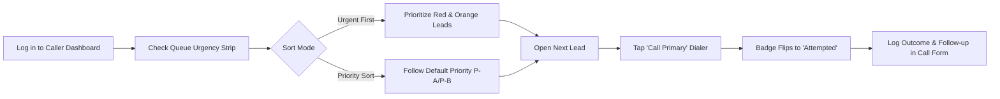
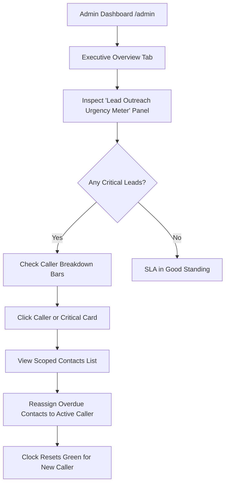

# Contact Urgency Meter — System Documentation & Workflows

## 1. Executive Summary

The **Contact Urgency Meter** is an automated, real-time Service Level Agreement (SLA) tracking system for Call Track. It monitors how quickly newly assigned prospects receive their initial outreach from tele-callers and freelancers.

### Why This Was Built
Leads grow cold quickly. When marketing contacts are assigned to callers, inaction often goes unnoticed until scheduled follow-up dates are missed or leads are lost. The Urgency Meter provides immediate visual accountability:
- Callers instantly see which assigned leads need immediate outreach.
- Admins can monitor team-wide outreach turnaround times and identify overdue bottlenecks before leads go cold.

---

## 2. Core Concepts & Architecture

### How the Clock Works
1. **Clock Start**: The clock starts at the exact timestamp of the **current assignment** (`AssignmentHistory.createdAt` where `toUserId` matches `contact.assignedToId`).
2. **Reassignment Reset**: If a contact is reassigned from Caller A to Caller B, the clock **resets to 0** for Caller B. A caller never inherits an overdue (red) status caused by a previous owner's inaction.
3. **Action Definition ("Attempted")**: The clock stops when a `CallAttempt` is recorded (`triggeredAt >= currentAssignedAt`) — i.e., when the caller taps the primary or WhatsApp dialer link. The badge transitions to **"Attempted"**, acknowledging outreach even before outcome notes are logged.
4. **Computed on Read (Zero Database Write Amplification)**:
   - Statuses are computed dynamically in **at most 2 queries** per batch request.
   - No cron jobs or database background writes are required as time passes, preserving SQLite database performance.
5. **Scope**:
   - Applies only to contacts awaiting first outreach (`status` in `'new'` or `'queued'`).
   - Contacts already past first outreach (`'contacted'`, `'follow_up'`, `'converted'`, `'lost'`) are marked **Excluded** from urgency tracking.
   - Contacts without an assigned caller are marked **Unassigned**.

---

## 3. Urgency Levels & Thresholds

| Badge State | Condition | Icon | Color Code | Description |
|---|---|---|---|---|
| **Fresh** | $< 24\text{ hours}$ | `CheckCircle2` | Green (`#10B981`) | Optimal initial outreach window. Freshly assigned. |
| **Pending** | $24\text{ – }72\text{ hours}$ | `Clock` | Amber / Orange (`#F59E0B`) | Outreach is pending. Needs attention before breaching SLA. |
| **Critical** | $\ge 72\text{ hours}$ | `AlertTriangle` | Rose / Red (`#F43F5E`) | SLA breached. Overdue for first contact. Urgent caller action required. |
| **Attempted** | Click-to-call logged | `PhoneCall` | Indigo / Purple (`#6366F1`) | Action taken. Caller clicked to call the prospect. Clock stopped. |
| **Unassigned** | No assignee | `HelpCircle` | Slate / Gray (`#64748B`) | Contact in pool awaiting admin allocation. |

---

## 4. Freelancer / Caller Workflow

As a caller, your primary daily objective is to ensure no assigned lead reaches the **Critical (>72h)** threshold.

### Step 1: Check the Queue Header
When you log in to `/freelancer`, tap the **My Leads** tab. At the top of your queue, you will see the **Urgency Summary Strip**:
- Example: `2 Red` · `3 Orange` · `5 Green` · `4 Attempted`
- This gives you an instant snapshot of your queue health.

### Step 2: Choose Your Sorting Mode
Next to the summary strip is the **Sort Mode Toggle**:
- **Urgent First**: Sorts your queue by urgency severity:
  $$\text{Critical (Red)} \longrightarrow \text{Pending (Orange)} \longrightarrow \text{Fresh (Green)} \longrightarrow \text{Attempted}$$
  *Recommended at the start of your shift to clear high-risk leads.*
- **Priority Sort**: Returns your queue to the default Priority ranking (`Priority A` before `Priority B`, ordered by recent updates).

### Step 3: Inspect Lead Badges & Tooltips
- On every lead card in your queue (and on the top **"Next Lead in Queue"** hero card), you will see the Urgency Badge.
- **Hover or tap** on any badge to see its tooltip:
  - *"Assigned 5h ago — turns orange at 24h"*
  - *"Assigned 31h ago — turns red at 72h"*
  - *"Assigned 78h ago — overdue for first outreach (>= 72h)"*

### Step 4: Initiate Call Session
1. Click **Call** on the lead.
2. Review the prospect's company details, contact history, and talking points.
3. Tap the **Call Primary** (or **Call WhatsApp**) button.
4. Tapping this button dials the phone and automatically registers an outreach timestamp.
5. Once registered, that lead's urgency badge immediately flips to **Attempted**.

### Step 5: Log Call Feedback & Follow-up
- Fill in the outcome response (e.g. *Connected — Interested*, *Not Connected*, etc.).
- Schedule a follow-up activity if required, and tap **Save & Return**.

---

## 5. Admin Workflow

Admins use the Urgency Meter to monitor SLA health across all callers, prevent leads from slipping through the cracks, and reassign neglected prospects.

### Step 1: Monitor Team SLA in the Executive Overview
1. Open `/admin` and ensure you are on the **Analytics** view $\rightarrow$ **Executive Overview** subtab.
2. Locate the **Lead Outreach Urgency Meter** panel:
   - **Header Status**: Displays either `✓ SLA In Good Standing` or `⚠️ X Overdue Leads`.
   - **Aggregate Metric Cards**:
     - **Critical (>72h)**: Leads waiting more than 3 days for a first call.
     - **Pending (24–72h)**: Leads approaching the SLA limit.
     - **Fresh (<24h)**: High-priority fresh leads assigned today.
     - **First Attempt Made**: Leads where outreach was already initiated.

### Step 2: Caller Workload & Urgency Breakdown
Underneath the aggregate cards in the panel, review the **Caller Urgency Breakdown**:
- Shows each caller currently holding assigned leads.
- Visual tri-color progress bar showing their proportion of Red, Orange, and Green leads.
- Text breakdown: e.g., `Sarah Freelancer: 4 red · 2 org · 8 grn`.
- Quickly spot if one caller has accumulated a backlog of neglected leads while others are clear.

### Step 3: Drill Down into Overdue Leads
1. Click on the **Critical (>72h)** card or switch directly to the **Contacts** tab.
2. In the Contacts table, each contact displays its live `<UrgencyBadge>` alongside its assignment and status pills:
   - `[QUEUED] [Pri A] [Sarah Freelancer] [Urgent: 78h]`
3. Click on any contact card to open the **Contact Detail Modal**:
   - The urgency badge is displayed directly in the modal header for immediate context.

### Step 4: Reassigning Overdue Leads
If a caller is unavailable, overwhelmed, or inactive:
1. Click the contact to open its details, or select multiple contacts using filters.
2. Reassign the contact to another approved caller.
3. **The Urgency Mechanism in Action**:
   - The contact's assignment record updates atomically.
   - For the new caller, the urgency badge **resets to Green (<24h)**.
   - The previous caller's inactivity no longer penalizes the new caller.

---

## 6. Technical Specifications

### Data Model & Indexing
- **Covering Index**: Added `@@index([contactId, createdAt])` to the `AssignmentHistory` model in Prisma.
- **Query Efficiency**:
  - Step 1: Partitions contacts in memory into unassigned, excluded, and candidates.
  - Step 2: Single query with `orderBy: { createdAt: 'desc' }` fetches assignment histories for candidate IDs.
  - Step 3: Single query with `triggeredAt >= min(assignedAt)` fetches call attempts.
  - Step 4: Per-contact in-memory evaluation guarantees zero cross-assignment pollution.

### API Contracts
- `GET /api/contacts`: Returns `Contact & { urgency: ContactUrgency }`.
- `POST /api/contacts`: Atomically logs `AssignmentHistory` (`reason: 'contact_created'`) when created with an assignee.
- `GET /api/agent/dashboard`: Returns `queue: (Contact & { urgency: ContactUrgency })[]` and `urgencySummary: { green, orange, red, attempted }`.
- `GET /api/admin/analytics`: Returns `urgency: { counts, byFreelancer }`.
